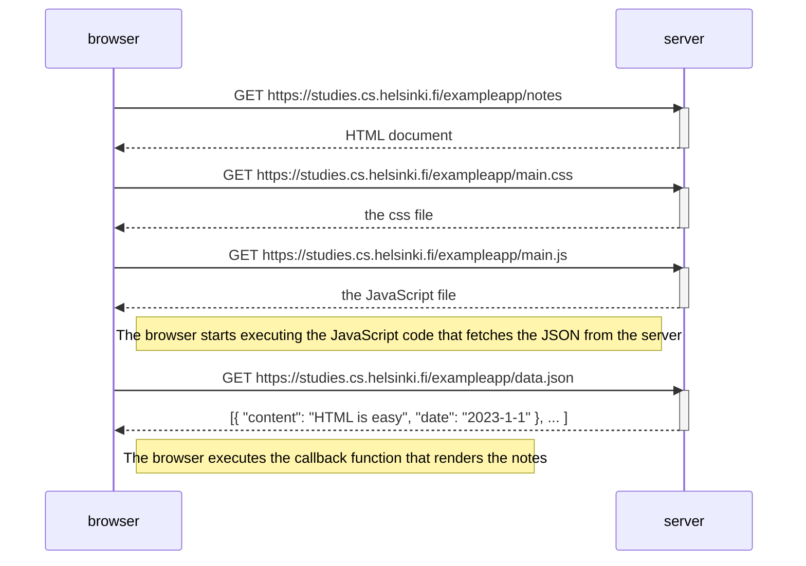

# Part 0 0.4: New note diagram
Loading a page containing JavaScript


# User submit the new note using form
Diagram is continued..

```mermaid
sequenceDiagram
    participant browser
    participant server
    
    browser->>server: POST https://studies.cs.helsinki.fi/exampleapp/new_note

    Note right of browser: Its a HTTP POST request with status code 302. Its a URL redirect.
    Note right of browser: Browser do a new HTTP GET request to the address --notes.
    Note right of browser: This causes three more HTTP requests.

    browser->>server: GET https://studies.cs.helsinki.fi/exampleapp/notes
    activate server
    server-->>browser: HTML document
    deactivate server

    browser->>server: GET https://studies.cs.helsinki.fi/exampleapp/main.css
    activate server
    server-->>browser: the css file
    deactivate server
    
    browser->>server: GET https://studies.cs.helsinki.fi/exampleapp/main.js
    activate server
    server-->>browser: the JavaScript file
    deactivate server

    Note right of browser: The browser starts executing the JavaScript code that fetches the JSON from the server

    browser->>server: GET https://studies.cs.helsinki.fi/exampleapp/data.json
    activate server
    Note right of browser: New note is added to data.json on the server
    server-->>browser: [{ "content": "HTML is easy", "date": "2023-1-1" }, ..,{"content":"new note","date":2023-12-27"} ]
    deactivate server

    end
'''    
