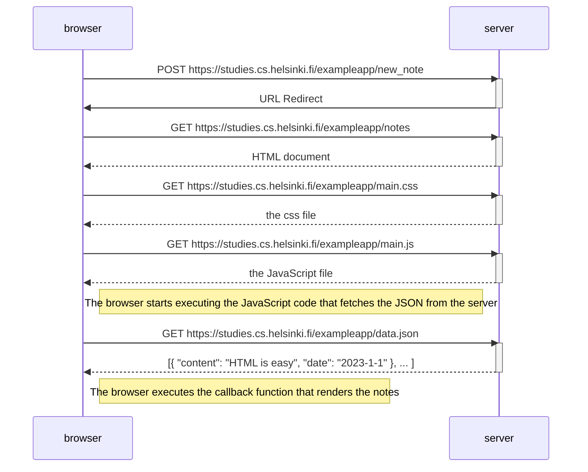

# Part 0 0.4: New note diagram
Loading a page containing JavaScript

# Part 0 0.4: User submit the new note using form
Diagram is continued..  
Its a HTTP POST request with status code 302. Its a URL redirect.  
Browser do a new HTTP GET request to the address --notes.  
This causes three more HTTP requests.

  
